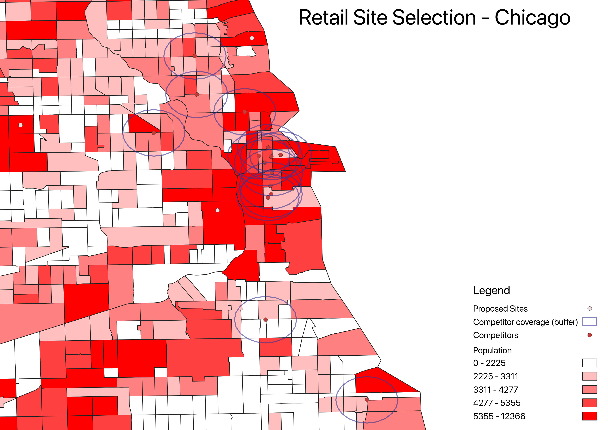

# Retail Site Selection (QGIS)

## Overview
This project uses QGIS to identify optimal new retail locations in Chicago based on population distribution and existing Starbucks store locations.

## Methodology
- Integrated U.S. Census tract data (population) with geographic boundaries
- Visualized population density using graduated choropleth mapping
- Mapped existing Starbucks locations as competitor sites
- Applied spatial buffering to model areas of existing market coverage
- Identified regions with high population and lower Starbucks presence

## Results
Proposed site locations are concentrated in western and southwestern Chicago, where population density remains high but Starbucks coverage is less saturated compared to the dense eastern/downtown cluster.

## Key Insight
Starbucks locations are heavily clustered in eastern Chicago, creating overlapping coverage areas. In contrast, several high-population tracts in western regions show limited coverage, indicating strong potential for expansion.

## Tools
- QGIS
- U.S. Census Data
- Spatial Join
- Buffer Analysis
